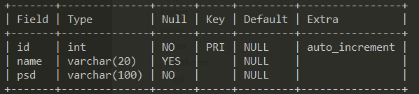
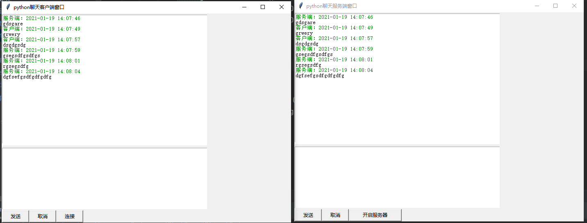

### 项目介绍

使用python中Socket编程方法和多线程，并结合Mysql数据库，实现聊天室的注册、登录，以及单对单聊天。

### 当前功能

1、登录界面，如果已有用户，登录成功跳转至聊天客户端；新用户则提示用户不存在。登录界面获取用户昵称，与数据库中昵称进行匹配。

2、注册界面，当前只有昵称和密码注册，新注册昵称与数据库中已有昵称不可重复

3、客户端和服务端GUI分别用于聊天，已经发送消息展示在GUI上部

### 使用方法

本项目需要已经安装Mysql，监测IP地址为本地地址，127.0.0.1

1、运行login.py文件，进行登录界面，输入用户名，密码登录，跳转至聊天用户客户端

2、运行SerGui.py文件，开启服务器客户端

3、点击服务器客户端开启按钮，开启服务器；点击用户客户端连接按钮，同服务器创建连接

4、无Mysql使用方法，直接点击运行ClientGui.py文件，然后执行步骤2和3。

### 环境配置

Python=3.6.10

Mysql=8.0.22.0

### 相关知识点

- Socket编程：https://gist.github.com/kevinkindom/108ffd675cb9253f8f71
- 多线程和多进程：https://muyuuuu.github.io/2020/03/16/multi-process-thread/

### 数据库设计

### Release-2021/1/18

1、已经实现用户登录校验，去数据库中匹配相关主键，如果昵称存在则直接转到聊天界面，如果不存在则提示注册  

2、注册界面正在开发，函数调用有一定问题  

3、可以单线程进行聊天

### Release-2021/1/19

1、单对单聊天时使用多线程技术，不必在发送消息后一直阻塞等待对方发来消息。

2、已经成功实现各个界面之间的跳转。

3、结果展示

### Release-2021/1/31

1、移除服务器端的GUI界面

2、使用epoll对所有的socket进行管理以及消息转发
